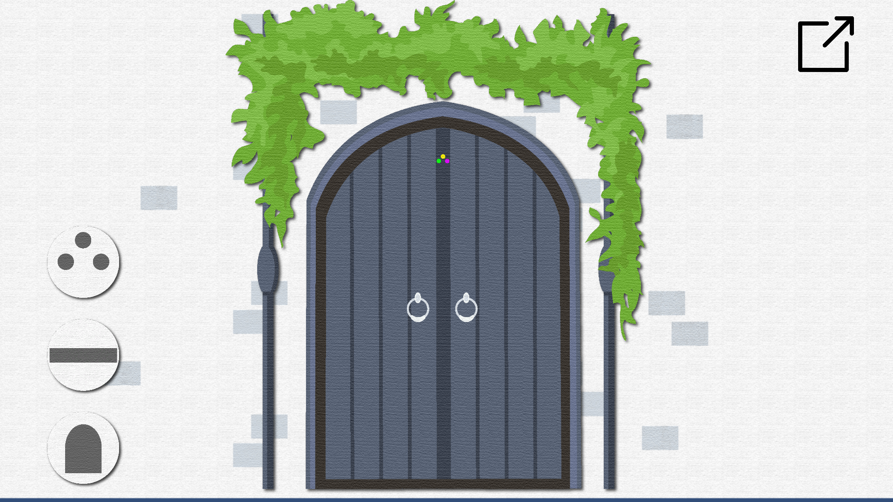

# PaperLayer

## Introduction
입체 페이퍼 커팅과 착시 퍼즐에서 아이디어를 얻어 제작       
종이 질감의 오브젝트와 몽환적인 디자인과 사운드

## Game Screenshots

chapter1

chapter2

chapter3
[video](youtube)

## How to Play
아이콘을 컨트롤해 해당 챕터의 착시 퍼즐을 푼다.  
  
아이콘을 길게 눌러 아이콘을 움직이게 하고 아이콘의 순서를 바꾸어 오브젝트의 순서를 바꾼다.  
특정 아이콘은 순서를 변경할 때 마다 오브젝트가 회전한다.  
특정 아이콘을 누를 때 반전시킨다.

## Contributing

